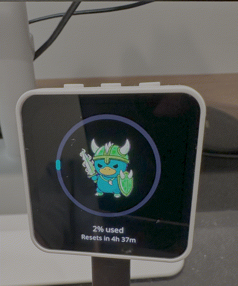
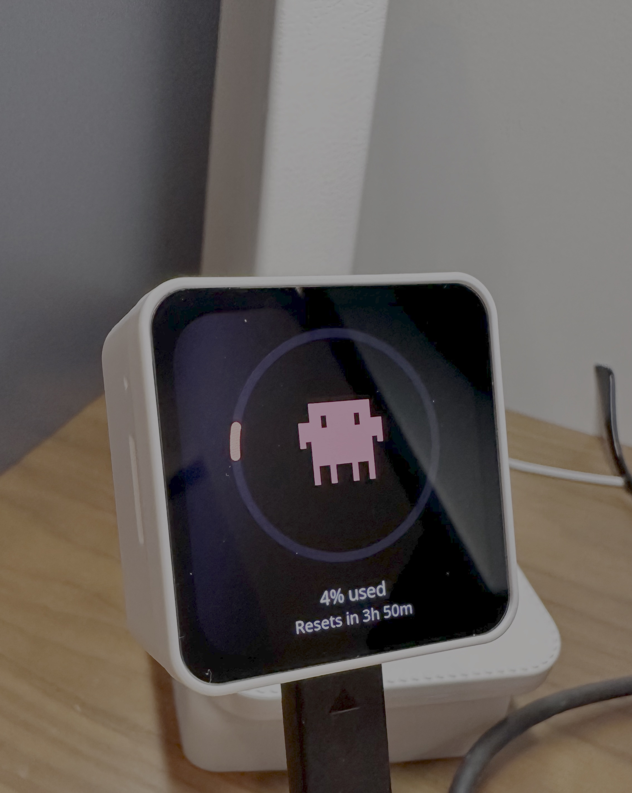

# Codagotchi - Your AI Token Pet

Codagotchi is open-source ESP32 firmware (plus a small macOS daemon) for a
round/portrait AMOLED desk display that turns your Claude Code and Codex usage
into a living creature. The more you maximize your token usage, the more your pet thrives.

<!-- TODO: replace with hero GIF of the device on a desk -->
<p align="center">
  
</p>
<p align="center">
  
  
</p>

[](https://github.com/Codagotchi/Codagotchi/actions/workflows/platformio-build.yml)
[](LICENSE)
[](https://github.com/Codagotchi/Codagotchi#supported-hardware)
[](https://github.com/Codagotchi/Codagotchi#system-requirements)

## Why it exists

If you're running Claude Code or Codex all day, token budgets are real. Codagotchi
makes that invisible context visible — on a little screen on your desk, not buried
in a browser tab.

- **Know your usage at a glance** — session and weekly utilization rings with a countdown to your next reset. No more hitting a wall mid-task.
- **See when your AI is working** — the pet wakes up and animates the moment your CLI starts generating. A peripheral glance tells you if it's still running.
- **Feed your pet** — press the button to interact with your AI companion and send a prompt to your CLI.
- **Time your heaviest tasks** — the reset countdown tells you exactly when your window refreshes so you can plan your most token-hungry work for a fresh budget.
- **Multi-provider** — switch between Claude and Codex on-device, each with their own pet and usage ring.
- **On-device model switching** — cycle the active model and send it to your CLI over BLE HID.
- **No cloud** — reads your existing CLI credentials locally. Nothing leaves your machine except the usage data going to the device over Bluetooth.
- **Multi-board** — a clean HAL means new displays are a folder + a build env, not a rewrite.

## How it works

```
┌──────────────────────┐    BLE GATT (JSON usage)    ┌──────────────────────┐
│  Host daemon (macOS) │  ─────────────────────────▶ │  ESP32 firmware      │
│  polls Claude/Codex  │                             │  "Codagotchi"        │
│  usage APIs          │  ◀───────────────────────── │  gauge + pet + HID   │
└──────────────────────┘    BLE HID (keystrokes)     └──────────────────────┘
```

The daemon reads your existing Claude/Codex CLI credentials locally, polls each
provider's usage endpoint, and notifies the device over a custom BLE service. The
device also acts as a BLE keyboard, so buttons can send keystrokes (model switch,
voice-mode toggle, "feed") back to your CLI.

## Supported hardware

| Board | Build env | Display | Touch | Notes |
|-------|-----------|---------|-------|-------|
| Waveshare ESP32-S3-Touch-AMOLED-2.16 | `waveshare_amoled_216` | CO5300, 480×480 round | CST9220 | Original reference port |
| Waveshare ESP32-S3-Touch-AMOLED-1.8  | `waveshare_amoled_18`  | SH8601, 368×448 portrait | FT3168 | XCA9554 IO expander |
| Waveshare ESP32-C6-Touch-AMOLED-2.16 | `waveshare_amoled_216_c6` | CO5300, 480×480 round | CST9220 | No PSRAM; on-device screenshot disabled |

Adding a new board is documented in [`docs/porting/adding-a-board.md`](docs/porting/adding-a-board.md).

> **Platform:** the host daemon currently targets **macOS** (launchd + Keychain).
> Other operating systems coming soon.

## System requirements

- **macOS** (daemon uses launchd + Keychain on Mac)
- **Python 3.9+** (`python3 --version`)
- **PlatformIO** (`brew install platformio`)
- **Claude Code** installed and signed in — the daemon reads its OAuth token from the Keychain
- **Codex CLI** (optional) — if `~/.codex/auth.json` exists, Codex usage is auto-detected
- A supported Waveshare ESP32-S3 AMOLED board (see table above)

## Quick start

### 1. Flash the firmware

Requires [PlatformIO](https://platformio.org/) (`brew install platformio`).

```bash
./flash-mac.sh waveshare_amoled_216

# or directly with PlatformIO
pio run -d firmware -e waveshare_amoled_216 -t upload
```

Pick the env that matches your board from the table above.

### 2. Run the host daemon

The daemon uses your **existing** Claude Code / Codex CLI logins — sign into those
first. It reads credentials locally (Keychain for Claude, `~/.codex/auth.json` for
Codex) and never transmits them anywhere but the provider's own API.

```bash
./install-mac.sh        # installs a launchd agent + Python venv
```

The daemon discovers the device by BLE name ("Codagotchi") on first run and
caches its address. See [`daemon/`](daemon/) for the service files.

## Controls

**Tap the screen** or press the **middle / PWR button** to cycle through screens:

| Screen | What it shows |
|--------|---------------|
| Usage (Claude) | Session + weekly usage bars, active model, animated status |
| Claude pet | Creature with usage ring — goes full-screen when Claude Code is active |
| Bluetooth | Connection status and device address |
| Usage (Codex) | Same layout for Codex *(shown when Codex provider is active)* |
| Codex pet | Codex creature with usage ring |

**Left button** — sends Space to the CLI (toggles voice mode in Claude Code).

**Right button** *(S3 boards only)* — cycles the active model and sends it to the CLI over BLE HID.

**Middle / PWR button** — cycles screens (same as tap); on the splash screen, cycles animations.

> The AMOLED-1.8 has no right button. Its PWR button is read via the XCA9554 IO expander.

## Repository layout

```
firmware/        ESP32 firmware (PlatformIO). Shared code + per-board HAL folders.
  src/hal/       Board-agnostic interfaces (display, touch, input, power, imu).
  src/boards/    One folder per supported board.
  src/           ui, splash (pet engine), ble, fonts, icons.
daemon/          macOS daemon that polls provider APIs and pushes usage over BLE.
tools/           Asset pipelines (pet/sprite/icon/font converters).
docs/porting/    Contributor guides (adding a board, HAL contract, capability flags).
assets/          Source fonts/icons/art.
```

## Customizing the pet

Pets are the most fun thing to contribute. There are **two rendering engines**;
pick the one that matches your art.

### A) Spritesheet pet (full-color, arbitrary resolution)

Best for richer characters. Source art is a sprite **atlas**: an 8-column ×
9-row grid of **192×208 px** cells on a transparent background. Row order is
`idle, running-right, running-left, waving, jumping, failed, waiting, running,
review`. The firmware currently uses **row 0 (idle)** and **row 2 (running-right,
mapped to "running")**, switching between them based on whether your CLI is busy.

1. Create a pet folder containing `pet.json` and `spritesheet.webp`:

   ```json
   // pet.json
   {
     "id": "mypet",
     "displayName": "My Pet",
     "description": "A friendly desk companion."
   }
   ```

2. Generate the C header:

   ```bash
   python3 tools/pet_to_lvgl.py path/to/mypet \
       --out firmware/src/codex_pet_frames.h \
       --scale 0.5          # render size; --idle-scale / --running-scale to differ
   ```

   The tool composites transparency against the black theme background, trims
   trailing empty frames, and auto-derives an accent color from the art.

3. Rebuild and flash. Preview locally first with `python3 tools/preview_pet.py`.

### B) Palette pet (tiny 20×20, 10-color indexed)

Best for minimalist pixel-art. Each animation is a list of 20×20 frames indexing
a 10-color palette.

```bash
# Author/drop JSON animations into tools/claudepix_data/<name>.json:
#   { "palette": ["#RRGGBB", ... up to 10],
#     "frames":  [ { "hold": 120, "grid": [[0,1,...20 wide], ... 20 tall] } ] }

# Then convert to the firmware header:
node tools/convert_to_c.js          # → firmware/src/splash_animations.h
```

Rebuild and flash. The splash engine cycles animations and (for the default pet)
picks liveliness based on your usage rate.

> ⚠️ **Art licensing:** the pets shipped in this repo are placeholders under
> restrictive licenses (see [License](#license)) and **cannot be redistributed**.
> Contribute pets you own or that are clearly under a permissive/CC license.

### Roadmap: first-class pets & providers

A refactor is in progress to make pets and providers fully data-driven — drop a
folder of art + a tiny descriptor and register it with **zero edits to shared
code**, mirroring the existing board HAL. Until that lands, adding a *second*
spritesheet pet requires renaming the generated symbols. Track it in the issues.

## Contributing

Contributions are welcome — new boards, new pets, new providers, bug fixes.

- New board? Follow [`docs/porting/adding-a-board.md`](docs/porting/adding-a-board.md)
  and the [HAL contract](docs/porting/hal-contract.md).
- Please keep shared code board- and provider-agnostic (no `#ifdef BOARD_*` in
  `main.cpp`/`ui.cpp` — use the HAL / capability flags).

## License

MIT — see [`LICENSE`](LICENSE).

**Not covered by MIT (do not redistribute):** the bundled fonts
(`firmware/src/font_tiempos_*.c`, `font_styrene_*.c`), the Claude "Clawd"
pixel-art in `firmware/src/splash_animations.h` (by [@amaanbuild](https://claudepix.vercel.app)),
and the Codex pet sprite in `firmware/src/codex_pet_frames.h`
(by [@Critters_Quest](https://codingpets.com)). These are placeholders pending
openly-licensed replacements; bring your own assets for a redistributable build.

## Troubleshooting

**Device doesn't connect after BLE pairing**

The daemon caches the resolved BLE address at `~/.config/codagotchi/ble-address`. If you swap boards or re-flash a different board, delete the cache to force a fresh scan:

```bash
rm ~/.config/codagotchi/ble-address
```

**Daemon not starting**

```bash
launchctl list | grep codagotchi        # check if agent is loaded
tail -F ~/Library/Logs/codagotchi.err.log  # see error output
```

Re-run `./install-mac.sh` if the agent isn't listed.

**Usage not updating**

Make sure you're signed into Claude Code (`claude login`) before running the daemon. The daemon checks for the Keychain entry at startup and will warn if it's missing.

## Acknowledgements

**Pet art:**

- The Codex pet sprite is by **[@Critters_Quest](https://codingpets.com)** ([codingpets.com](https://codingpets.com)).
- The Claude "Clawd" pixel-art is by **[@amaanbuild](https://claudepix.vercel.app)** ([claudepix.vercel.app](https://claudepix.vercel.app)).

These pets are placeholders under their creators' licenses and **cannot be
redistributed** — see [License](#license). Huge thanks to both artists.

**Built on** [LVGL](https://lvgl.io/), [GFX Library for Arduino](https://github.com/moononournation/Arduino_GFX),
[NimBLE-Arduino](https://github.com/h2zero/NimBLE-Arduino), and the
[pioarduino](https://github.com/pioarduino) ESP32 platform.
